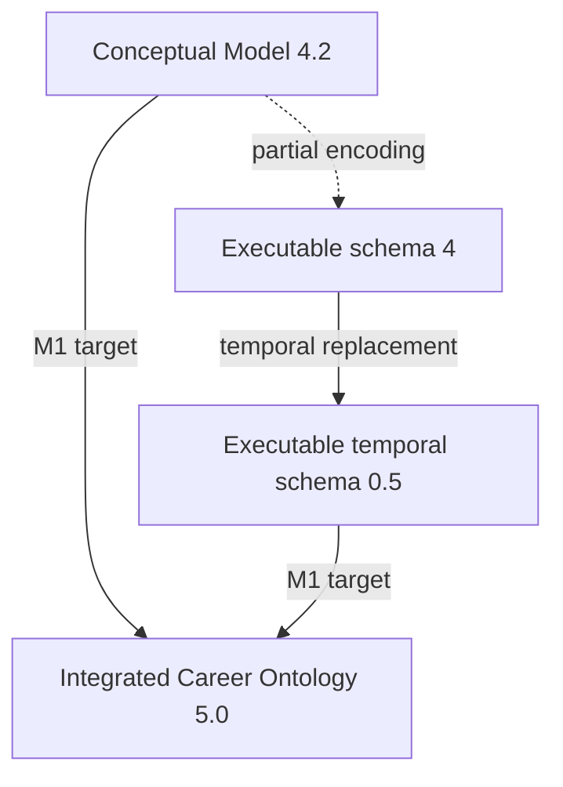

# M1-A — Career Ontology Reconciliation

## 1. Purpose

This report establishes the exact relationship among three artifacts that had
previously been described too loosely as one evolving model:

1. **Career Model 4.2**, the broad conceptual candidate;
2. executable ontology version **`4`** in `caron`;
3. executable temporal ontology version **`0.5`** in `caron`.

M1-A is an inventory and diagnosis. It does not silently extend the ontology or
settle the remaining semantic choices. Its output is the evidence needed for
M1-B decisions and the integrated Career Ontology specification.

> **M1-B resolution:** `0.5` was the working target label when this diagnostic
> was written. M1-B preserves implemented ontology `0.5` and assigns the new
> integrated semantic generation the exact version `5.0`. References below to
> an integrated `0.5` are historical planning labels, not current version
> declarations.

The principal conclusion is:

> Executable `0.5` is currently a temporal successor of the compact executable
> `4` schema. It is not yet an executable integration of conceptual Model 4.2.

This is not evidence that the implementation is wrong. The compact spine was a
deliberate way to test validation, query, temporal, witness, and visualization
boundaries. It does mean that the version lineage must distinguish conceptual
adoption from executable coverage.

## 2. Sources and authority

| Source | Snapshot | Role in this reconciliation |
|---|---|---|
| *Career Model — Purpose, Requirements, and Competency Questions* | SHA-256 `c342c328...153717e` | Authority for purpose, R1–R13, CQ1–CQ12, and evaluation categories |
| *Career Model 4.2 — Executable Candidate Specification* | 2026-09-03; SHA-256 `a15d4e51...213c6a9` | Canonical conceptual candidate and semantic inventory |
| `caron/ontology.py`, validation, queries, views, and tests | Git baseline `7cbd0d8` | Authority for current executable behavior |
| [v0.5 temporal contract](career-model-v0.5-temporal-contract.md) | SHA-256 `a2ccd924...b255f` | Normative source for adopted temporal semantics |
| *Career Ontology Implementation Architecture Contract* 0.2 | Draft; SHA-256 `8cd6c511...e0e9cd` | Target architecture constraints; not an ontology authority |
| [package-boundary decisions](career-ontology-package-boundaries.md) | SHA-256 `4aff11fc...e23db1` | Accepted current implementation boundary summary |

The historical *Career Model 4 — Contextual Experience and Cross-Context
Development* and earlier models explain how Model 4.2 was reached. They do not
override Model 4.2 or current accepted executable tests.

The precedence rule used here is:

```yaml
authority:
  purpose_and_competency: purpose_requirements_document
  conceptual_domain_meaning: career_model_4_2
  temporal_domain_meaning: v0_5_temporal_contract
  executable_behavior: current_code_and_tests
  implementation_boundaries: accepted_package_boundaries
```

Where these disagree, M1-A records the disagreement. It does not choose one by
accident.

## 3. Classification vocabulary

| Classification | Meaning |
|---|---|
| `exact` | The executable form preserves the conceptual distinction and signature |
| `encoded_differently` | The distinction exists with a different but plausibly equivalent runtime encoding |
| `partial` | Only part of the conceptual domain or contract is executable |
| `absent` | No current executable construct represents the distinction |
| `divergent` | The executable schema makes a decision that the conceptual source did not adopt or contradicts it |
| `superseded_in_0.5` | A version-`4` representation was deliberately replaced by the temporal contract |
| `outside_runtime_ontology` | The concern belongs to assertion, query, interpretation, adapter, or application contracts |

`Absent` does not automatically mean “add it.” M1-B must still determine
whether the difference reflects a required semantic distinction, a deliberate
subset, a query limitation, or deferred scope.

## 4. Version lineage



The identifiers are labels in different histories:

- **Model 4.2** is a conceptual model revision and the historical conceptual
  predecessor of the integrated ontology;
- executable **`4`** is the compact compatibility schema first implemented in
  `caron`;
- executable **`0.5`** copies the executable `4` concepts, relations, and
  requirements while replacing coarse context time with `TemporalExtent`;
- the planned **integrated Career Ontology `5.0`** must combine the adopted
  Model 4.2 semantic inventory with the accepted temporal contract.

Therefore, numeric ordering between `4.2` and `0.5` has no meaning. Migration
and compatibility must use explicit identifiers and declarations.

## 5. Entity reconciliation

Conceptual Model 4.2 defines 13 entity types. Both executable schemas currently
define the same 10 types.

| Model 4.2 entity | Status in 4.2 | Executable `4` | Executable `0.5` | Classification and consequence |
|---|---|---|---|---|
| `Person` | adopted | present | present | `exact` |
| `Collective` | adopted | absent | absent | `absent`; collective agency and attribution cannot be represented |
| `Context` | adopted | present with `start`, `end`, `status` | present with `temporal_extent` | semantic core is `exact`; properties require separate reconciliation |
| `Activity` | adopted | present | present | `exact` |
| `Technology` | adopted | present | present | `exact` |
| `Method` | adopted | present | present | `exact` |
| `Subject` | adopted | present | present | `exact` |
| `Language` | adopted | absent | absent | `absent`; language cannot remain distinct from technology or subject |
| `Artifact` | adopted | present | present | `exact` |
| `Proposition` | adopted | present | present | `exact` at type level; locality is reviewed below |
| `Organization` | adopted | present | present | `exact` at type level |
| `Place` | provisional | present | present | `divergent`: the runtime also adopts `occurs_at`, while 4.2 explicitly has no adopted place connector |
| `Credential` | adopted | absent | absent | `absent`; credentials cannot be distinguished from their evidencing artifacts |

### 5.1 Type families

| Model 4.2 family | Conceptual members | Current executable equivalent | Classification |
|---|---|---|---|
| `Agent` | `Person`, `Collective` | relation signatures use `Person` directly | `partial` |
| `Learnable` | `Technology`, `Method`, `Subject`, `Language` | `exposed_to` and `learns` accept the first three | `partial` |
| `IntellectualResource` | `Method`, `Subject` | `draws_on` accepts both | `exact` |

The current meta-model expresses endpoint unions directly as sets of concept
identifiers. It has no separately named family objects. That representation is
adequate if the integrated ontology preserves the same admissible endpoints.

## 6. Property and value reconciliation

| Concern | Model 4.2 / temporal contract | Executable `4` | Executable `0.5` | Classification |
|---|---|---|---|---|
| Universal display label | Not a central semantic claim | required text `label` on every concept | same | implementation convention, not an ontology discrepancy |
| Context status | coarse enumerated, explicitly non-temporal | optional unconstrained text | absent | `partial` in `4`; `divergent` in `0.5` because the temporal contract says status has no temporal semantics, not that it ceases to exist |
| Context start/end | domain time still open in 4.2 | optional integer years | absent | `superseded_in_0.5` |
| Context temporal extent | accepted v0.5 month-level contract | absent | optional `TemporalExtent` | `exact` for current temporal scope |
| Proposition content | meaningful reified content | required text | required text | `exact` |
| Proposition local context | exactly one local context; representation still open | required entity-reference property | same | semantic requirement `exact`; property-versus-relation representation remains open |
| Participation and association roles | named role vocabularies | optional free text where present | same | `partial`; values are neither closed nor typed |

The most concrete contract/code contradiction is Context `status`: version
`0.5` reconstructs the Context definition with only `label` and
`temporal_extent`, whereas the temporal contract merely forbids using status as
time evidence. M1-B must decide whether status remains, is deprecated, or is
removed explicitly.

## 7. Relation reconciliation

Conceptual Model 4.2 defines 30 relation structures. The executable schemas
define the same 19 relation kinds; `0.5` changes their temporal interpretation
but not their signatures.

| Model 4.2 relation | Conceptual signature | Executable encoding | Classification |
|---|---|---|---|
| `PartOf` | `Context → Context` | `part_of` | `exact` signature; acyclicity missing |
| `SuborganizationOf` | `Organization → Organization` | absent | `absent` |
| `Performs` | `Agent → Activity` | `Person → Activity` | `partial`; no collective performer |
| `OccursIn` | `Activity → Context` | `occurs_in` | `exact` |
| `Participation` | agent, context, role, optional organization | `participates_in(Person, Context)` with optional text role | `partial`; person-only and no organization field |
| `CollectiveMembership` | person, collective, context, role | absent | `absent` |
| `OrganizationAssociation` | organization, context, role | `associated_with(Context, Organization)` without role | `partial` and directionally different, though the binary endpoints are preserved |
| `Exposure` | person, learnable, context | `exposed_to(Person, Technology|Method|Subject)` plus required context qualifier | `encoded_differently`; `Language` missing |
| `Learning` | person, learnable, context | `learns(Person, Technology|Method|Subject)` plus required context qualifier | `encoded_differently`; `Language` missing |
| `UsesTechnology` | `Activity → Technology` | branch of `uses(Activity, Technology|Artifact)` | `encoded_differently`; distinction recoverable from target kind |
| `UsesArtifact` | `Activity → Artifact` | branch of `uses(Activity, Technology|Artifact)` | `encoded_differently`; distinction recoverable from target kind |
| `UsesLanguage` | `Activity → Language` | absent | `absent` |
| `Applies` | `Activity → Method` | `applies` | `exact` |
| `DrawsOn` | `Activity → Method|Subject` | `draws_on` | `exact` |
| `NativeLanguage` | `Person → Language` | absent | `absent` |
| `TakesInput` | `Activity → Artifact` | `takes_input` | `exact` |
| `Produces` | `Activity → Artifact` | `produces` | `exact` |
| `Modifies` | `Activity → Artifact` | absent | `absent`; CQ5 cannot distinguish production from modification |
| `AwardedTo` | `Credential → Person` | absent | `absent` |
| `AwardedBy` | `Credential → Organization` | absent | `absent` |
| `ObtainedThrough` | `Credential → Context` | absent | `absent` |
| `EvidencedBy` | `Credential → Artifact` | absent | `absent` |
| `AimsAt` | `Context → Proposition` | `aims_at` | `exact` |
| `Addresses` | `Activity → Proposition` | absent | `absent`; activity-to-purpose evidence is incomplete |
| `Motivates` | `Proposition → Activity|Context` | `motivates` | `exact` |
| `ResultsIn` | `Activity → Proposition` | `results_in` | `exact` |
| `Establishes` | `Activity → Proposition` | `establishes` | `exact` |
| `Supports` | `Activity → Proposition` | `supports` | `exact` |
| `Contradicts` | `Activity → Proposition` | `contradicts` | `exact` |
| `BearsOn` | outcome proposition → aim proposition, with role constraints | absent | `absent`; exact CQ7 evaluation evidence is unavailable |

The executable-only relation is:

| Executable relation | Signature | Model 4.2 status | Classification |
|---|---|---|---|
| `occurs_at` | `Context → Place` | no place connector adopted; `Place` remains provisional | `divergent` |

Relation names alone do not determine semantic equivalence. The merged `uses`
relation preserves the target-kind distinction, whereas the reduced
participation structure loses fields and admissible agents.

## 8. Invariant reconciliation

### 8.1 Model 4.2 semantic invariants

| Invariant | Current executable status | Assessment |
|---|---|---|
| I1 — career structure is graph-shaped | generic entities and relations | `exact` |
| I2 — context supplies local meaning | context relations and qualifiers | `partial`; not every 4.2 contextual structure exists |
| I3 — reusable identity bridges contexts | stable entity identifiers | `exact` |
| I4 — performance and participation differ | distinct relation kinds | `exact` for persons |
| I5 — personal and collective agency differ | no `Collective` | `absent` |
| I6 — technology use is activity-grounded | `uses` starts at `Activity` | `exact` |
| I7 — exposure is weaker than learning | distinct `exposed_to` and `learns` | structurally `exact`; explicit non-inference regression is still desirable |
| I8 — learning does not imply mastery | no mastery relation or inference | boundary preserved, but not directly regression-tested |
| I9 — learning and application are independent | distinct `learns`, `uses`, `applies`, `draws_on` | `exact` |
| I10 — method, technology, subject, and language differ | first three distinct; `Language` absent | `partial` |
| I11 — artifact, credential, and proposition differ | artifact and proposition distinct; `Credential` absent | `partial` |
| I12 — ability, experience, and capability are downstream claims | no primitive runtime types | `exact` boundary |
| I13 — composition must not invent meaning | temporal classifications and explicit path tests preserve this | `partial` but strongly represented |
| I14 — narratives and patterns are derived | absent from semantic core | `exact` boundary |
| I15 — absence is not explicit negation | `Coverage` prevents strong absence claims; explicit negative assertions are unavailable | `partial` |

### 8.2 Executable constraints

| Model 4.2 constraint | Current status | Finding |
|---|---|---|
| Entity identifiers are nonempty | not checked | missing validation rule |
| Entity identifiers are unique | checked | implemented |
| Relation identifiers are stable and unique | explicit `RelationAssertion.id`; duplicates rejected | implemented; the former relation-identity open question is resolved |
| Relation endpoints are typed and present | checked | implemented |
| Proposition context references a present Context | checked through required typed reference | implemented |
| Context `PartOf` is acyclic | not checked | missing graph invariant |
| Organization hierarchy is acyclic | relation absent | unavailable |
| `BearsOn` role constraints hold | relation absent | unavailable |
| Every Activity has at least one performer | checked | implemented, but only a `Person` can perform |
| Every Activity has exactly one most-local context | checked as exactly one `occurs_in` | implemented provisionally |
| Credential cardinalities | credential vocabulary absent | unavailable |

Executable `0.5` additionally validates local temporal extents and direct and
transitive containment consistency. The traversal prevents infinite recursion,
but it does not diagnose a cyclic `part_of` graph. Temporal consistency and
structural acyclicity are separate obligations.

## 9. Temporal reconciliation

| Temporal contract decision | Executable `0.5` status |
|---|---|
| Exact ontology identifier `caron.career-model` version `0.5` | implemented |
| Canonical month-level `YearMonth` | implemented and property-tested |
| Known, unknown, and `ongoing_as_of` end states | implemented |
| No wall-clock advancement of ongoing evidence | implemented |
| Intrinsic Context `TemporalExtent` | implemented |
| `part_of` containment, including transitive constraints | implemented |
| `occurs_in` bounds an Activity without copying an extent | implemented in queries |
| Participation and relation-level temporal qualification | explicitly deferred |
| Exact, bounded, indeterminate, and observation-relative month counts | implemented |
| Entailed, possible, excluded, and unknown predicates | implemented |
| Window selection with definite/possible modes | implemented |
| Witness-preserving temporal results | implemented |
| Derived temporal values remain outside asserted relations | implemented in `GraphView.results` |
| Explicit `4` → `0.5` migration | validation rejects mismatched versions; no migration operation exists |
| Context status remains non-temporal | not implemented because status disappears from the `0.5` schema |

The temporal slice is therefore substantially aligned with its contract. Its
main reconciliation issues are integration with the complete semantic
vocabulary, Context status, structural acyclicity, and an explicit migration
declaration or operation.

## 10. Architecture-contract reconciliation

| Contract area | Current implementation | Classification |
|---|---|---|
| Explicit immutable ontology with identity and version | `OntologySchema` | implemented |
| Candidate-to-validated boundary | `RealisationCandidate` → `Accepted` or `Rejected` | implemented |
| Immutable validated realisation | frozen records, construction token | implemented |
| Realisation source-state version | stable `id`, but no separate version or digest | `partial` |
| Stable relation identity | explicit relation IDs and duplicate validation | implemented |
| Structured coverage | status plus scope | implemented |
| Structured diagnostics | code, severity, layer, record, field | implemented for ontology and validation; query/application layers absent |
| Small public typed retrieval catalogue | temporal functions and whole-realisation selection | implemented, narrow by design |
| Private replaceable execution algebra | `_query_algebra.py` | implemented and deliberately private |
| Unified `QueryResult` envelope | no general result object | `absent`; typed scalar answers and `GraphView` coexist |
| Retrieval identity and parameters | `GraphView.query_name`; parameters not retained | `partial` |
| Ontology and source realisation identity in results | ontology present; source realisation ID present; source version absent | `partial` |
| Witness preservation | temporal results and algebra rows retain witnesses | implemented for current queries |
| Coverage on every result | present on `GraphView`; absent from standalone predicate and month-count values | `partial` |
| Diagnostics on every result | field on `GraphView`; direct queries raise parameter exceptions | `partial` |
| Immutable endpoint-closed `GraphView` | enforced | implemented |
| Explicit GraphView partiality | expressed through scoped `Coverage`, not a separate flag | implemented if coverage semantics remain normative |
| Derived results distinct from assertions | typed results remain metadata, not relation assertions | implemented |
| Renderer independence | Cytoscape adapter consumes `GraphView` | implemented |
| Codec and repository contracts | absent | deliberately deferred |

This comparison does not justify wrapping every answer in one large class.
M1 must define the common obligations and allow answer-specific structures.
`GraphView` should remain a structural projection that may accompany a broader
query result, not become the universal answer algebra.

## 11. CQ1–CQ12 assessment of executable `0.5`

The assessment uses the categories required by the purpose specification. It
separates representation adequacy from the currently small public retrieval
catalogue.

| CQ | Current assessment | Evidence and limitation |
|---|---|---|
| CQ1 — Context | directly represented; query limitation | `occurs_in` and recursive `part_of` represent context, but no public named context-navigation query exists |
| CQ2 — Purpose | representable but awkward | `aims_at` and `motivates` exist; missing `Addresses` weakens activity-specific purpose reconstruction |
| CQ3 — Personal contribution | directly represented for persons; incomplete domain | `performs` distinguishes personal work from participation, but collective agency is absent |
| CQ4 — Means and resources | directly represented | `uses`, `takes_input`, `applies`, and `draws_on` preserve major roles; language use is absent |
| CQ5 — Production | partially represented | production and inputs are distinct; modification and maintenance cannot be stated distinctly |
| CQ6 — Outcomes | directly represented | `results_in`, `establishes`, `supports`, and `contradicts` preserve outcome distinctions |
| CQ7 — Evaluation against purpose | not currently representable exactly | `BearsOn` is absent; activity-mediated paths must not be promoted to evaluation evidence |
| CQ8 — Problem-solving trajectory | derivable by licensed composition | outcome relations plus explicit `motivates` paths are exercised by the internal algebra; chronology alone is excluded |
| CQ9 — Demonstrated ability | query/interpretation limitation | evidence can be selected with witnesses, but ability remains a downstream claim and no interpretation contract is implemented |
| CQ10 — Learning and transfer | derivable for supported resource kinds; query limitation | shared identity connects contextual learning and activity use; Language and a stable public history query are absent |
| CQ11 — Recurring patterns | query/interpretation limitation | evidence can be retrieved, but pattern acceptance remains an unimplemented interpretation |
| CQ12 — External relevance | interaction/interpretation limitation | external needs correctly remain outside the ontology; comparison operations are not implemented |

The current runtime is strongest for CQ1, CQ3, CQ4, CQ6, CQ8, and the evidence
side of CQ10. CQ7 is the clearest missing semantic relation. CQ9, CQ11, and CQ12
must not be “fixed” by adding primitive ability, pattern, or job-requirement
entities to the career ontology.

## 12. Reconciled findings

### 12.1 Confirmed decisions

The following are no longer open:

- relation assertions have stable explicit identities;
- executable ontology identity and exact version matching are enforced;
- candidate and validated realisations are distinct;
- validated records and graph views are immutable;
- temporal occurrence uses explicit month-level values with epistemic end
  states;
- query witnesses are structural traceability, not proof;
- `GraphView` is a partial renderer-neutral projection, not a realisation;
- query algebra remains private;
- Cytoscape JSON is a presentation projection, not semantic serialization.

### 12.2 Material semantic gaps

If integrated `0.5` is to implement adopted Model 4.2 rather than remain an
explicit subset, it must address:

- `Collective` and collective attribution;
- `Language` and language-specific relations;
- `Credential` and its relations;
- `SuborganizationOf` and organization hierarchy;
- full participation and organization-association structure;
- `Modifies`;
- `Addresses`;
- `BearsOn` and its role constraints;
- the adopted acyclicity and identifier constraints.

### 12.3 Encoding choices rather than demonstrated semantic gaps

These require an explicit compatibility decision but not necessarily new
domain meaning:

- split `UsesTechnology` and `UsesArtifact` versus one typed `uses` relation;
- n-ary record types versus binary relations with typed qualifiers;
- named type-family objects versus endpoint-kind sets;
- proposition locality as a property versus a graph relation;
- a distinct partiality flag versus structured `Coverage`.

### 12.4 Concerns outside the runtime ontology

These remain real project gaps but must not inflate the ontology:

- assertion polarity, confidence, source, and version;
- a unified public query-result contract;
- realisation source-state version identity;
- serialization and persistence;
- application operations and interaction workflows;
- downstream abilities, recurring patterns, and external relevance claims.

## 13. M1-B decision queue

M1-B should decide only the questions required to write the integrated 0.5
contract. Recommended order:

1. **Target breadth:** confirm that integrated `0.5` adopts the full adopted
   Model 4.2 vocabulary rather than declaring the compact executable subset as
   the long-term ontology.
2. **Place:** remove or demote `Place` and `occurs_at`, unless one concrete
   competency case warrants an adopted place connector.
3. **Context status:** retain it as explicitly non-temporal, deprecate it, or
   remove it with an explicit migration decision.
4. **Proposition locality:** keep the required entity-reference property or
   replace it with an explicit relation; do not support two competing
   authorities.
5. **`BearsOn` validity:** define which same-context, ancestor/descendant, or
   cross-context pairs are admissible.
6. **Relation encoding:** decide whether endpoint-disjoint uses remain one
   relation and how n-ary participation, membership, and association are
   represented by the meta-model.
7. **Provisional cardinalities:** retest activity and credential constraints
   against representative cases before declaring them permanent.
8. **Common result obligations:** define the shared metadata carried by query
   results without making `GraphView` the universal result type.

Assertion integration, serialization, a public plan language, richer temporal
qualification, and UI controls do not block the integrated ontology contract
and should remain deferred to their roadmap milestones.

## 14. M1-A acceptance

M1-A is complete when the following statements are true:

- every Model 4.2 entity and relation has an executable classification;
- conceptual and executable constraints are compared explicitly;
- the `4` → `0.5` temporal delta is separated from the Model 4.2 integration
  gap;
- architecture-contract mismatches are distinguished from ontology gaps;
- CQ1–CQ12 have a current assessment using the agreed diagnostic categories;
- resolved questions are not reopened;
- unresolved questions are routed to M1-B or a later architectural milestone.

This report satisfies those conditions. It does not by itself change ontology
meaning or executable compatibility.
